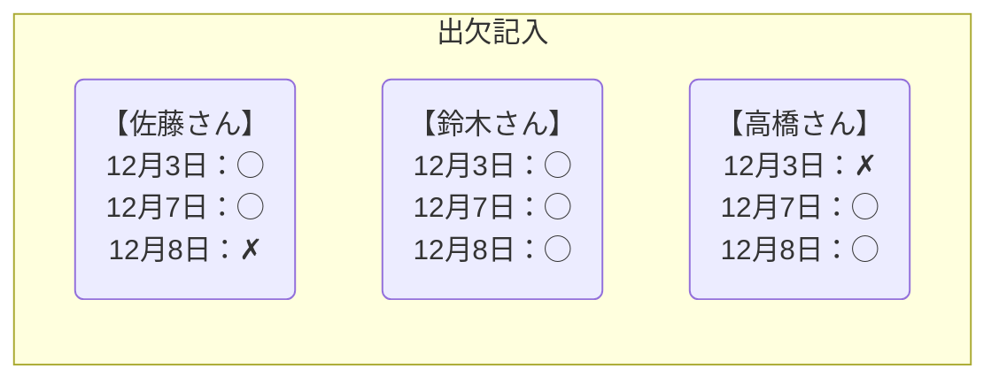
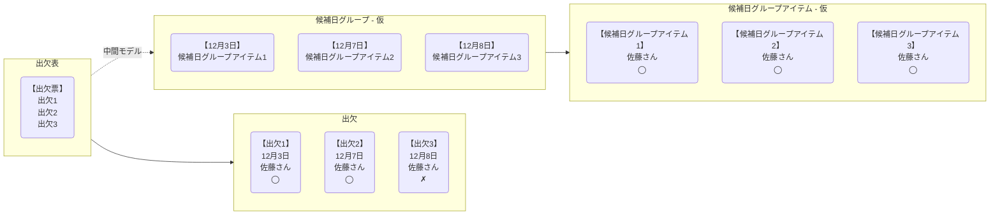

# MF2025 ワークショップ①『モデル駆動設計をやってみよう』

- [MF2025 ワークショップ①『モデル駆動設計をやってみよう』](https://umtp-japan.org/event-seminar/mf2025/76609)
- [モデル駆動設計をやってみよう Modeling Forum2025ワークショップ/Let’s Try Model-Driven Design](https://speakerdeck.com/haru860/lets-try-model-driven-design)

# シンプル版

## ユースケース

- 参加者が日程調整を作成する
    - 候補日を選択する
- 参加者が出欠を登録する
    - 候補日に対し、ユーザーが◯か✗かを入力する
    - 未記入の候補日があってはならない
- システムが最適な日付を確定する
    - 新しいユーザーが出欠を登録するたびに、システムによる最適な日付の確定が行われる
    - 最も◯が多い候補日を確定する
    - 最も丸が多い候補日が複数ある場合、複数の最適な日付を確定する

## モデル

参加者が出欠を登録するユースケース

システムが最適な日付を確定するユースケース

## 振り返り

- 「候補日グループ - 仮」の中間モデルを用意するか？
  - 「週ごとに出欠をまとめ、カウントする処理」は専用モデルがあった方がコードを理解しやすいと考えた
  - しかし、「候補日グループ - 仮」はドメイン上のモデルではなく、あくまでもプログラミングを助けるための中間モデルでしかない
